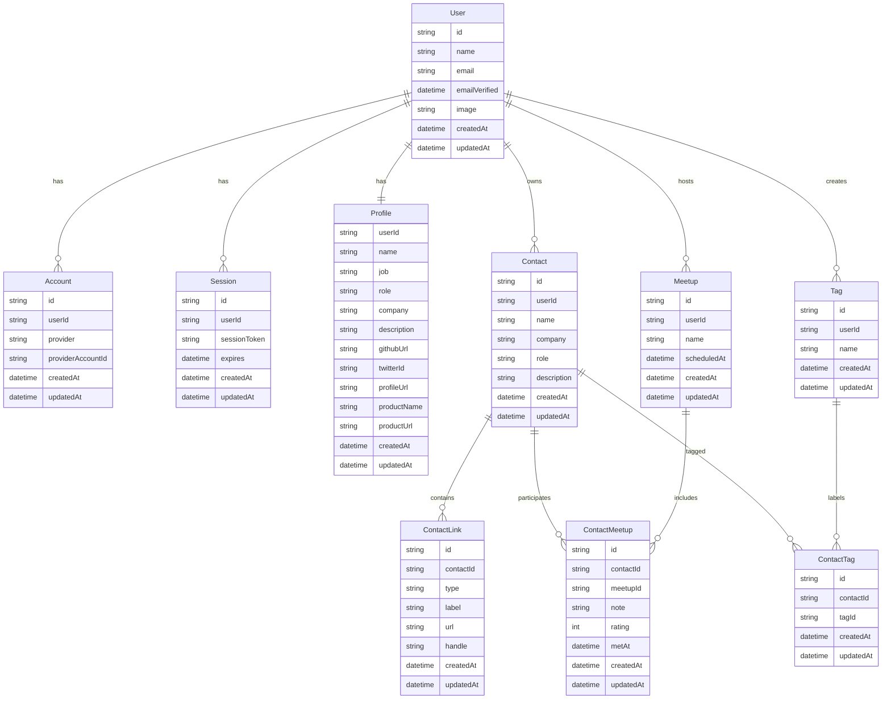

# DB 設計

## users（OAuthのみ / cuid）

| カラム名       | 型          | 制約・備考                              |
| -------------- | ----------- | --------------------------------------- |
| id             | text        | PK / cuid（`DEFAULT cuid()` 相当）      |
| name           | text        | NULL 可                                 |
| email          | text        | NOT NULL / UNIQUE                       |
| email_verified | timestamptz | NULL 可（Auth.jsの `emailVerified` 準拠） |
| image          | text        | NULL 可                                 |
| created_at     | timestamptz | NOT NULL / `DEFAULT now()`              |
| updated_at     | timestamptz | NOT NULL / トリガー更新                 |

## contacts（cuid）

| カラム名    | 型          | 制約・備考                           |
| ----------- | ----------- | ------------------------------------ |
| id          | text        | PK / cuid                            |
| user_id     | text        | NOT NULL / FK → `users.id`（所有者） |
| name        | text        | NOT NULL                             |
| job         | text        | NULL 可                              |
| role        | text        | NULL 可                              |
| company     | text        | NULL 可                              |
| description | text        | NULL 可                              |
| created_at  | timestamptz | NOT NULL / `DEFAULT now()`           |
| updated_at  | timestamptz | NOT NULL / トリガー更新              |

※ 外部リンク等の可変情報は `contact_links` へ分離

## meetups（cuid）

| カラム名     | 型          | 制約・備考                       |
| ------------ | ----------- | -------------------------------- |
| id           | text        | PK / cuid                        |
| user_id      | text        | NOT NULL / FK → `users.id`       |
| name         | text        | NOT NULL                         |
| scheduled_at | timestamptz | NOT NULL（開催/参加日時）        |
| created_at   | timestamptz | NOT NULL / `DEFAULT now()`       |
| updated_at   | timestamptz | NOT NULL / トリガー更新          |

## contact_meetups（cuid）

| カラム名   | 型          | 制約・備考                                    |
| ---------- | ----------- | --------------------------------------------- |
| id         | text        | PK / cuid                                     |
| contact_id | text        | NOT NULL / FK → `contacts.id`                 |
| meetup_id  | text        | NOT NULL / FK → `meetups.id`                  |
| note       | text        | NULL 可（その出会いでのメモ）                |
| rating     | int         | NULL 可（評価など任意スコア）                |
| met_at     | timestamptz | NULL 可（当日の上書き用など）                |
| created_at | timestamptz | NOT NULL / `DEFAULT now()`                    |
| updated_at | timestamptz | NOT NULL / トリガー更新                       |

一意制約: `(contact_id, meetup_id)` を推奨（同一組合せは一意）

## tags（cuid）

| カラム名   | 型          | 制約・備考                       |
| ---------- | ----------- | -------------------------------- |
| id         | text        | PK / cuid                        |
| user_id    | text        | NOT NULL / FK → `users.id`       |
| name       | text        | NOT NULL                         |
| created_at | timestamptz | NOT NULL / `DEFAULT now()`       |
| updated_at | timestamptz | NOT NULL / トリガー更新          |

一意制約（推奨）: `(user_id, name)` の複合一意

## contact_tags（cuid）

| カラム名   | 型          | 制約・備考                       |
| ---------- | ----------- | -------------------------------- |
| id         | text        | PK / cuid                        |
| contact_id | text        | NOT NULL / FK → `contacts.id`    |
| tag_id     | text        | NOT NULL / FK → `tags.id`        |
| created_at | timestamptz | NOT NULL / `DEFAULT now()`       |
| updated_at | timestamptz | NOT NULL / トリガー更新          |

## profiles（cuid）

| カラム名     | 型          | 制約・備考                 |
| ------------ | ----------- | -------------------------- |
| user_id      | text        | PK / FK → `users.id`       |
| name         | text        | NOT NULL                   |
| job          | text        | NULL 可                    |
| role         | text        | NULL 可                    |
| company      | text        | NULL 可                    |
| description  | text        | NULL 可                    |
| github_url   | text        | NULL 可                    |
| twitter_id   | text        | NULL 可                    |
| profile_url  | text        | NULL 可                    |
| product_name | text        | NULL 可                    |
| product_url  | text        | NULL 可                    |
| created_at   | timestamptz | NOT NULL / `DEFAULT now()` |
| updated_at   | timestamptz | NOT NULL / トリガー更新    |

## contact_links（cuid）

| カラム名    | 型          | 制約・備考                        |
| ----------- | ----------- | --------------------------------- |
| id          | text        | PK / cuid                         |
| contact_id  | text        | NOT NULL / FK → `contacts.id`     |
| type        | text        | NOT NULL（`LinkType` 想定の文字列）|
| label       | text        | NULL 可                           |
| url         | text        | NOT NULL                          |
| handle      | text        | NULL 可                           |
| created_at  | timestamptz | NOT NULL / `DEFAULT now()`        |
| updated_at  | timestamptz | NOT NULL / トリガー更新           |

## categories（cuid）

| カラム名    | 型          | 制約・備考                                  |
| ----------- | ----------- | ------------------------------------------- |
| id          | text        | PK / cuid                                   |
| user_id     | text        | NOT NULL / FK → `users.id`（所有者）        |
| name        | text        | NOT NULL                                     |
| slug        | text        | NOT NULL / ユーザー内で一意推奨              |
| parent_id   | text        | NULL 可 / FK → `categories.id`（自己参照）   |
| sort_order  | int         | NULL 可                                     |
| created_at  | timestamptz | NOT NULL / `DEFAULT now()`                   |
| updated_at  | timestamptz | NOT NULL / トリガー更新                      |

## contact_categories（cuid）

| カラム名     | 型          | 制約・備考                             |
| ------------ | ----------- | -------------------------------------- |
| id           | text        | PK / cuid                              |
| contact_id   | text        | NOT NULL / FK → `contacts.id`          |
| category_id  | text        | NOT NULL / FK → `categories.id`        |
| created_at   | timestamptz | NOT NULL / `DEFAULT now()`             |
| updated_at   | timestamptz | NOT NULL / トリガー更新                |

## accounts（Auth.js / Prisma Adapter, cuid）

| カラム名              | 型          | 制約・備考                                       |
| --------------------- | ----------- | ------------------------------------------------ |
| user_id               | text        | NOT NULL / FK → `users.id`                       |
| type                  | text        | NOT NULL                                         |
| provider              | text        | NOT NULL                                         |
| provider_account_id   | text        | NOT NULL                                         |
| refresh_token         | text        | NULL 可                                          |
| access_token          | text        | NULL 可                                          |
| expires_at            | int         | NULL 可                                          |
| token_type            | text        | NULL 可                                          |
| scope                 | text        | NULL 可                                          |
| id_token              | text        | NULL 可                                          |
| session_state         | text        | NULL 可                                          |
| created_at            | timestamptz | NOT NULL / `DEFAULT now()`                       |
| updated_at            | timestamptz | NOT NULL / トリガー更新                          |

主キー: `(provider, provider_account_id)` の複合主キー

## sessions（Auth.js / Prisma Adapter, cuid）

| カラム名       | 型          | 制約・備考                              |
| -------------- | ----------- | --------------------------------------- |
| session_token  | text        | UNIQUE                                   |
| user_id        | text        | NOT NULL / FK → `users.id`               |
| expires        | timestamptz | NOT NULL                                  |
| created_at     | timestamptz | NOT NULL / `DEFAULT now()`                |
| updated_at     | timestamptz | NOT NULL / トリガー更新                   |

